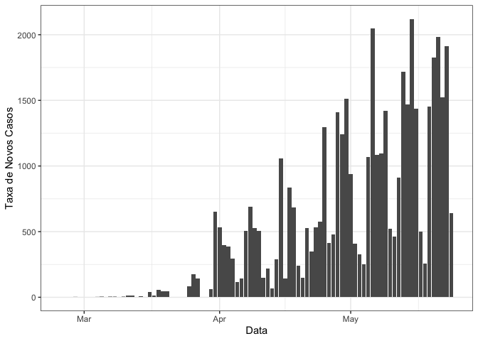

## Obtenção de Dados

Afim de simplificar o acesso aos dados, utilizou-se o pacote `coronabr`, que importa diariamente os dados compilados pela iniciativa [Brasil IO](http://www.brasil.io). Pode ser o caso de se considerar a redução de dependências e acessar os dados diretamente da plataforma supracitada, entretanto há facilidades implementadas no `coronabr` que podem ser úteis. Para que colaboradores que não utilizam o R como plataforma analítica, o arquivo `covid19_cidades.csv` possui os dados (por cidade) disponíveis hoje (Wed Apr  1 12:25:00 2020).


```r
library(coronabr)
library(tidyverse)
library(lubridate)
covid19_cidades = get_corona_br()
write_csv(covid19_cidades, "covid19_cidades.csv")
write_csv(covid19_cidades, paste0("covid19_cidades-", today(), ".csv"))
save(covid19_cidades, file="covid19_cidades.rda")
save(covid19_cidades, file=paste0("covid19_cidades-", today(), ".rda"))
unlink("output", recursive=TRUE)
```

## Manipulação de dados

Abaixo, são apresentados dados da cidade de São Paulo, apenas por esta ter sido a cidade onde foi identificado o paciente zero do Brasil e haver um histórico maior de informações, que podem ser úteis para a modelagem de casos e óbitos.

#### TODO

  * Observar ocorrências de zeros na coluna `confirmed` (vide 24/03/2020)


```r
casos_sp = covid19_cidades %>% filter(city == "São Paulo") %>% 
  select(-state, -place_type, -is_last, -city_ibge_code)
casos_sp = casos_sp %>% mutate(confirmed=case_when(
  date == as.Date("2020-03-24") ~ as.integer(717),
  TRUE ~ confirmed))
casos_sp %>% head() %>% knitr::kable("markdown")
```


|date       |city      | confirmed| deaths| estimated_population_2019| confirmed_per_100k_inhabitants| death_rate|
|:----------|:---------|---------:|------:|-------------------------:|------------------------------:|----------:|
|2020-03-31 |São Paulo |      1885|    121|                  12252023|                       15.38521|     0.0642|
|2020-03-30 |São Paulo |      1233|    103|                  12252023|                       10.06364|     0.0835|
|2020-03-27 |São Paulo |      1044|     62|                  12252023|                        8.52104|     0.0594|
|2020-03-26 |São Paulo |       899|     53|                  12252023|                        7.33756|     0.0590|
|2020-03-25 |São Paulo |       722|     44|                  12252023|                        5.89290|     0.0609|
|2020-03-24 |São Paulo |       717|     36|                  12252023|                             NA|         NA|

```r
casos_sp %>% select(date, confirmed, deaths) %>% gather(type, counts, -date) %>% 
  ggplot(aes(date, counts, colour=type)) + geom_point() + geom_line() + scale_y_log10() +
  theme_bw() + xlab("Data") + ylab("Contagem")
```

<!-- -->

## Taxas de Mudança


```r
temp = casos_sp %>% select(date, confirmed, deaths) %>% arrange(date) %>% 
  mutate(dx=as.integer(date-lag(date, default=date[1])),
         dconf=confirmed-lag(confirmed, default=confirmed[1]),
         rate = dconf/dx)
ggplot(temp, aes(date, rate)) + geom_line() + geom_point() +
  theme_bw()
```

```
## Warning: Removed 1 row(s) containing missing values (geom_path).
```

```
## Warning: Removed 1 rows containing missing values (geom_point).
```

<!-- -->


## Contato

Para maiores informações, utilize a plataforma [https://covid.ic.unicamp.br/](https://covid.ic.unicamp.br/). Em particular, procuramos documentar informações desta inciativa no seu respectivo tópico em Modelagem e Epidemiologia ([https://covid.ic.unicamp.br/c/tecnolC3B3gicas/ModelagemeEpidemiologia/11](https://covid.ic.unicamp.br/c/tecnolC3B3gicas/ModelagemeEpidemiologia/11)).
