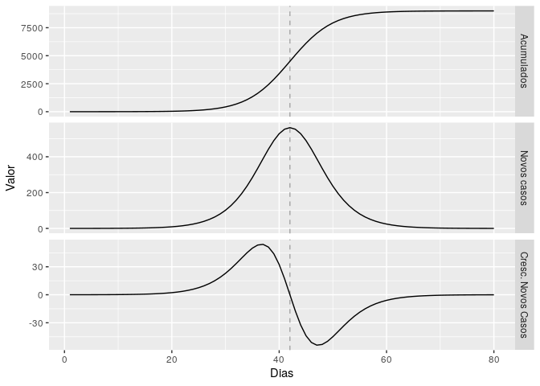
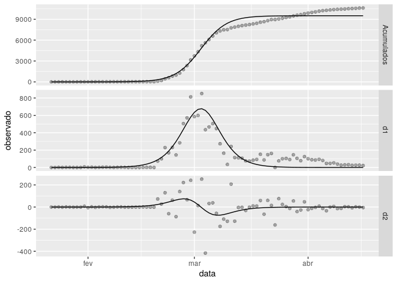
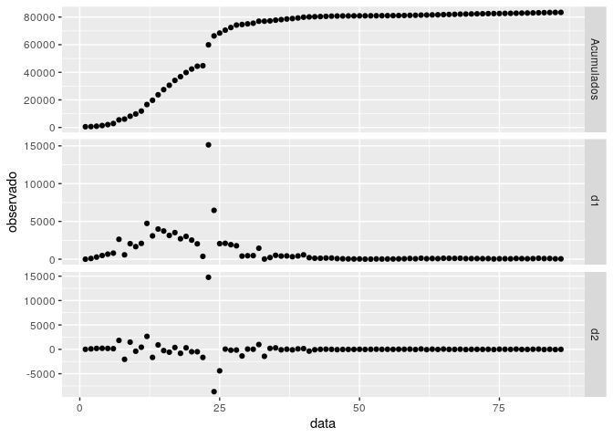
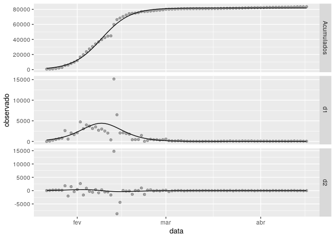
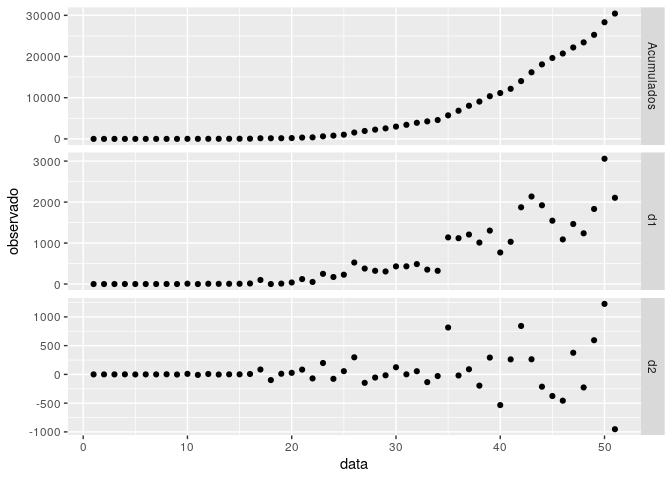
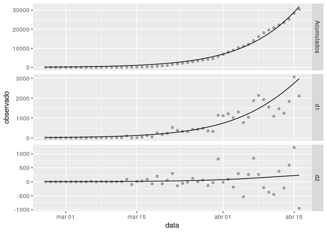
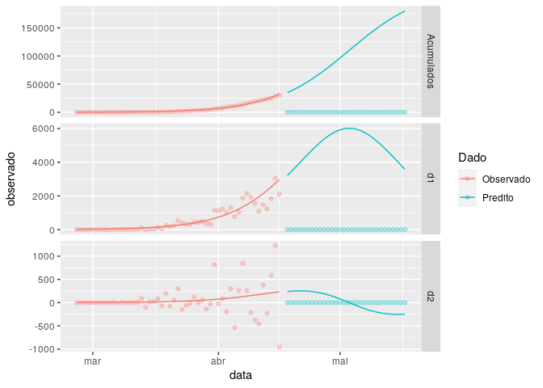

Modelo Derivadas
================
Gabriel Franco

# Introdução

Queremos obter a melhor predição para as seguintes curvas ao longo dos
dias de casos acumulados, novos casos e crescimento de novos casos, como
no exemplo a seguir.

``` r
## Setup
my_pars <- c(9000,42,4)
f0 <- d0f(1:80, my_pars)
f1 <- d1f(1:80, my_pars)
f2 <- d2f(1:80, my_pars)

## Plot
data.frame(Dias = rep(1:80,3),
           var = rep(factor(c("Acumulados", "Novos casos", "Cresc. Novos Casos"),
                            levels=c("Acumulados", "Novos casos", "Cresc. Novos Casos")), 
                        each=80),
           Valor = c(f0,f1,f2)) %>% 
  ggplot(aes(Dias,Valor)) +
  geom_line() +
  geom_vline(xintercept = 42, linetype=2, alpha=.3) +
  facet_grid(var~., scales="free_y")
```



Seja  a curva acumulada de casos, podemos modelar por uma curva
logística

<p align="center"></p>

com  sendo o número máximo de casos ao longo do tempo,
 o tempo  em que atingimos este número máximo e
 sua velocidade de crescimento. No exemplo acima,
,  e .

Consequentemente, o número de novos casos por dia e seu crescimento são
modelados pela primeira e segunda derivada de , respectivamente.

Assim, dado que estamos antes do pico  e que temos dados de
casos acumulados observados, qual a melhor maneira de estimar esses três
parâmetros de forma a obter uma boa estimativa de ?

# Proposta

Gostaríamos os parâmetros fossem bons o suficientes para que as três
curvas fossem bem ajustadas. Com isso, sejam

  -  o número de casos acumulados observados no tempo ,
  -  o número de novos casos observados no tempo  e
  -  o crescimento observado de novos casos no tempo ,

vamos minimizar a função a seguir em relação :

<p align="center"></p>

sendo  pesos pré-definidos (ou não). A princípio,
propõe-se que  seja o maior peso de todos para que a curva se
ajuste melhor nos casos observados.

# Exemplos

``` r
df <- CSSEGISandData() %>%
  filter(Country.Region %in% c("China", "Korea, South", "Brazil"),
         casosAcumulados > 0) %>%
  group_by(Country.Region) %>%
  mutate(d1 = c(0, diff(casosAcumulados)), 
         d2 = c(0, diff(d1)))
```

## Coreia, a referência

``` r
dd_korea <- df %>% 
  filter(Country.Region=="Korea, South") %>% 
  mutate(days = seq_along(data))

opt_korea = opt(data = dd_korea, 
                chute = c(10000,30,1), 
                pesos = c(0.01,0.01,5), 
                log=TRUE)
opt_korea[["plot"]]
```



## China

O ajuste para China não é tão fácil quanto o da Coreia e precisamos de
chutes iniciais melhores. Vejamos os dados observados

``` r
dd_china <- df %>% 
  filter(Country.Region=="China") %>% 
  mutate(days = seq_along(data))

visu(dd_china)
```



Com o gráfico acima, temos uma noção do chute dos parâmetros:
 e . Com isso, temos o resultado abaixo.

``` r
chute_china = c(max(dd_china[["casosAcumulados"]]),
                22,
                4) ## chute completamente aleatório
opt_china = opt(data=dd_china,chute = chute_china, pesos=c(1,2,4))
opt_china[["plot"]]
```



``` r
opt_china[["pars"]]
```

    ## [1] 81758.618764    18.910523     4.626901

## Brasil

O Brasil é o caso mais difícil pq não sabemos em que pé estamos.

``` r
dd_br <- df %>% 
  filter(Country.Region=="Brazil") %>% 
  mutate(days = seq_along(data))

visu(dd_br)
```



Note que a curva de casos acumulados e novos casos não tem nenhuma
indicação de que vai começar a desacelerar. Portanto, precisamos limitar
os parâmetros conforme conhecimentos prévios e observações de cenários
em outros países. Os chutes iniciais são bem ruins a princípio:
 e .

``` r
chute_br = c(220000,#10*max(dd_br$casosAcumulados),
             60,
             4) ## chute completamente aleatório
opt_br = opt(data=dd_br,chute = chute_br, pesos=c(1,2,4), lim_inf = c(0,44,0))
opt_br[["plot"]]
```



### Predição

Dados os chutes iniciais e os dados que temos, a data esperada de pico
em 2020-05-03, com um total de casos estimados em 220000 (muito perto do
chute inicial).

``` r
dd_pred = opt_br[["pred"]]
dd_pred[["days"]] = rep(seq_along(unique(dd_pred[["data"]])),3)

futuro = 30
dias_fut = seq(from=max(dd_pred[["days"]])+1,
             to=max(dd_pred[["days"]])+futuro)
dd_append = data.frame(data = rep(rep(dd_pred[["data"]][1],futuro),3), ## inicializando
                       var = rep(unique(dd_pred[["var"]]),each=futuro),
                       observado = 0,
                       estimado = c(d0f(dias_fut, opt_br[["pars"]]), 
                                    d1f(dias_fut, opt_br[["pars"]]), 
                                    d2f(dias_fut, opt_br[["pars"]]) 
                                    ),
                       days = rep(dias_fut,3))
dd_append[["data"]] = dd_br[["data"]][1] + dias_fut
dd_pred[["Dado"]] = "Observado"
dd_append[["Dado"]] = "Predito"
pred_br = rbind(dd_pred,dd_append)
pred_br %>% 
  as.data.frame() %>% 
  ggplot(aes(data,observado,col=Dado)) +
  geom_point(alpha=.3) +
  geom_line(aes(y=estimado)) +
  facet_grid(var~., scales="free_y")
```



### Resumo

  - Data esperada de pico: 2020-05-03
  - Número estimado de máximo de casos em um dia: 6011

-----

# Estudo preditivo

Vamos estudar os casos de China e Coreia e verificar em quantos dias
antes do pico é possível estimá-lo com melhor precisão.

## O experimento

Em construção…

# Observações e ideias

**Todas as estimativas acima precisam ser melhoradas\!**

  - Suavizar as curvas melhora as estimativas?
  - Incerteza das estimativas pode ser dada pela Hessiana, mas é ruim
  - Depende muito do chute inicial, principalmente o número total de
    infectados acumulados. Talvez pegar estimativas de outros estudos.

# A fazer

  - Organizar melhor os dados
  - Estudar inferência
  - Testar com a Coreia e China o caso de quando ainda não passamos pelo
    pico
