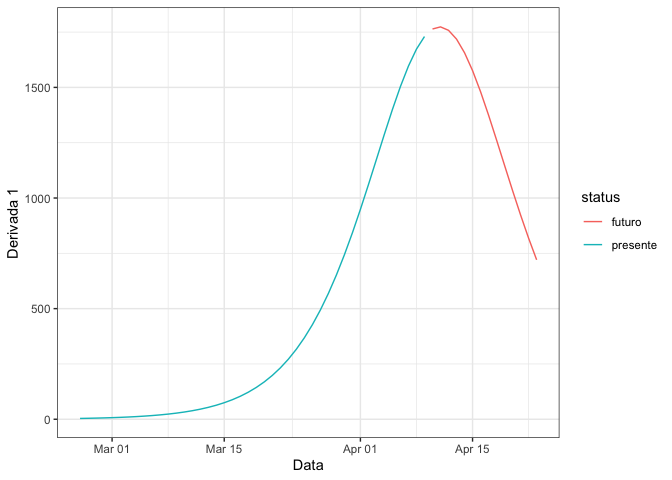
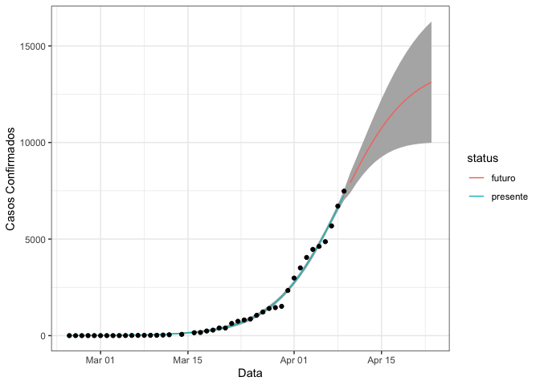
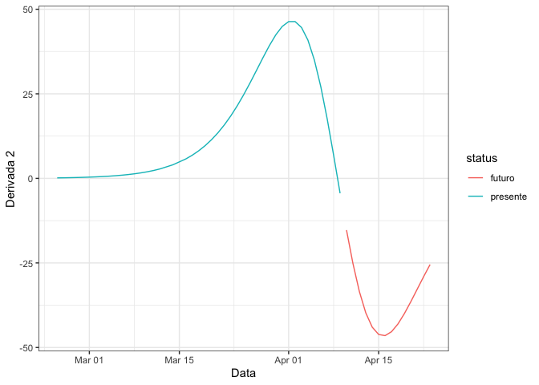

Modelando o Número Total de Casos de COVID-19 para o Brasil
================

## Introdução

Uma estratégia bastante comum para modelar curvas de crescimento é o
emprego da função logística ou sigmóide. Neste caso:


Nesta expressão, o parâmetro phi1 é a assíntota da curva (número máximo
de casos), phi2 é o tempo em que atinge-se a metade dos casos e 1/phi3 é
a velocidade de crescimento da função logística.

## Ajuste para Brasil

| date       | confirmed | deaths | d |
| :--------- | --------: | -----: | -: |
| 2020-02-26 |         1 |      0 | 0 |
| 2020-02-27 |         1 |      0 | 1 |
| 2020-02-28 |         1 |      0 | 2 |
| 2020-02-29 |         2 |      0 | 3 |
| 2020-03-01 |         2 |      0 | 4 |
| 2020-03-02 |         2 |      0 | 5 |

<!-- --><!-- --><!-- -->

|      |            x |
| ---- | -----------: |
| phi1 | 42084.911296 |
| phi2 |    44.880494 |
| phi3 |     5.931702 |

Estimativa do pico: 2020-04-10.

## Estado de São Paulo

``` r
indata = brasilio() %>%
  filter(place_type == "state", state=="SP") %>%
  select(date, confirmed, deaths) %>%
  ungroup() %>% prepData()
indata %>% head() %>% knitr::kable()
```

| date       | confirmed | deaths | d |
| :--------- | --------: | -----: | -: |
| 2020-02-25 |         1 |      0 | 0 |
| 2020-02-26 |         1 |      0 | 1 |
| 2020-02-27 |         1 |      0 | 2 |
| 2020-02-28 |         2 |      0 | 3 |
| 2020-02-29 |         2 |      0 | 4 |
| 2020-03-01 |         2 |      0 | 5 |

<!-- --><!-- --><!-- -->

|      |            x |
| ---- | -----------: |
| phi1 | 14030.398413 |
| phi2 |    43.608050 |
| phi3 |     5.384961 |

Estimativa do pico: 2020-04-08.

## Cidade de Campinas

``` r
indata = brasilio() %>%
  filter(place_type == "city", state=="SP", city=="Campinas") %>%
  select(date, confirmed, deaths) %>%
  ungroup() %>% prepData()
indata %>% head() %>% knitr::kable()
```

| date       | confirmed | deaths | d |
| :--------- | --------: | -----: | -: |
| 2020-03-18 |         1 |     NA | 0 |
| 2020-03-19 |         1 |     NA | 1 |
| 2020-03-20 |         1 |     NA | 2 |
| 2020-03-25 |         4 |      0 | 7 |
| 2020-03-26 |         4 |      0 | 8 |
| 2020-03-27 |         5 |      0 | 9 |

Estimativa do pico: 2020-04-30.

## Observação

O modelo precisa ser melhorado, pois as estimativas de pico não estão
apropriadas.
